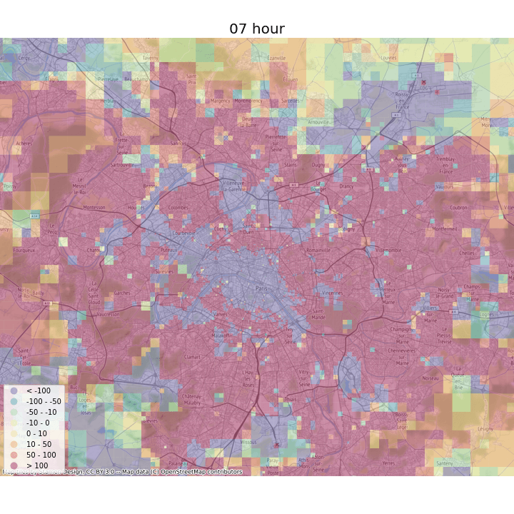
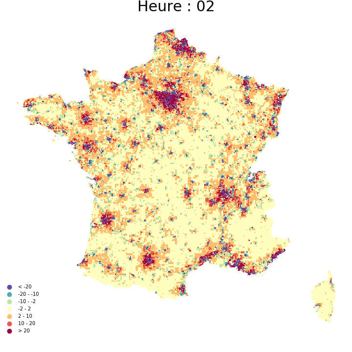
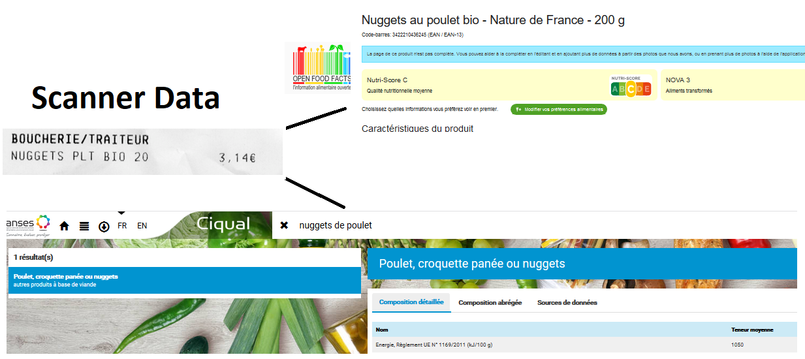

```{r setup, include=FALSE}
knitr::opts_chunk$set(echo = FALSE)
#install.packages('revealjs')
devtools::install_github("hadley/emo")

# Useful links: 
##https://bookdown.org/yihui/rmarkdown/revealjs.html 
## https://gist.github.com/rxaviers/7360908
```


# <large> Dynamic Population Mapping </large>

<small> Mobile Phone Data `r emo::ji('telephone_receiver')`and Fine Grained Resident Population Data `r emo::ji('house_with_garden')`</small>

<div class="columns-2">


</div> 

<small>Objective: Prototyping an experimental statistics in collaboration with a Mobile Network Operator [WPI Deliverable](https://ec.europa.eu/eurostat/cros/system/files/wpi_deliverable_i7_some_experimental_results_with_mobile_network_data_2021_01_31_final.pdf)</small>


# Enrich scanner data with product-level features


<small>Objective: consumption characteristics at fine spatial scale</small>
